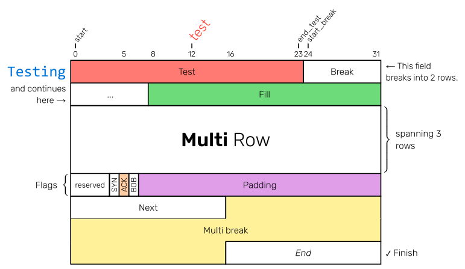

# typst-bytefield 

A simple way to create network protocol headers in typst.

Using [tablex](https://github.com/PgBiel/typst-tablex) under the hood.


## Example



⚠️ This example is a **preview** what will be possible in the next version (v0.0.4) which will be ready soon. (🤞 hopefully)


```typst
#import "@preview/bytefield:0.0.3": *

#bytefield(
  bits(4)[Version], bits(4)[TTL], bytes(1)[TOS], bytes(2)[Total Length],
  bytes(2)[Identification], bits(3)[Flags], bits(13)[Fragment Offset],
  bytes(1)[TTL], bytes(1)[Protocol], bytes(2)[Header Checksum],
  bytes(4)[Source Address],
  bytes(4)[Destination Address],
  bytes(3)[Options], bytes(1)[Padding]
)
```

## Usage

To use this library through the Typst package manager (for Typst v0.6.0+), import bytefield with `#import "@preview/bytefield:0.0.3": *` at the top of your file.

The package contains some of the most common network protocol headers: `ipv4`, `ipv6`, `icmp`, `icmpv6`, `dns`, `tcp`, `udp`.

## Features

See [example.typ](example.typ) for a preview of the features in v.0.0.4. Some things might change so.

### Features v0.0.3 
At the moment very limited features. Next version will extend this. So this section will be removed soon.

- Select the number of bits in one row. The default value is 32. `bytefield(bits: 32)`
- Specify the shown bit numbers in the header through the `header` argument. Example: `bytefield(header: (0,8,16,31))` 
- Select the height of the rows. Default is **2.5em**. Example: `bytefield(rowheight: 20pt)`  
- Adding fields with a predefined length of bits or bytes. 
- Fields with a length greater than a row will automatically wrap. 
  - If a field-length is the multiple of a row-length it will automatically render with a higher rowheight. Example see *Ipv6*. 
- Fill up the remaining space of a row with the `padding` field.
- Coloring fields through the `fill` argument. For example: `bits(32, fill: red.lighten(30%))[Test]` 


# Changelog

See [CHANGELOG.md](CHANGELOG.md)